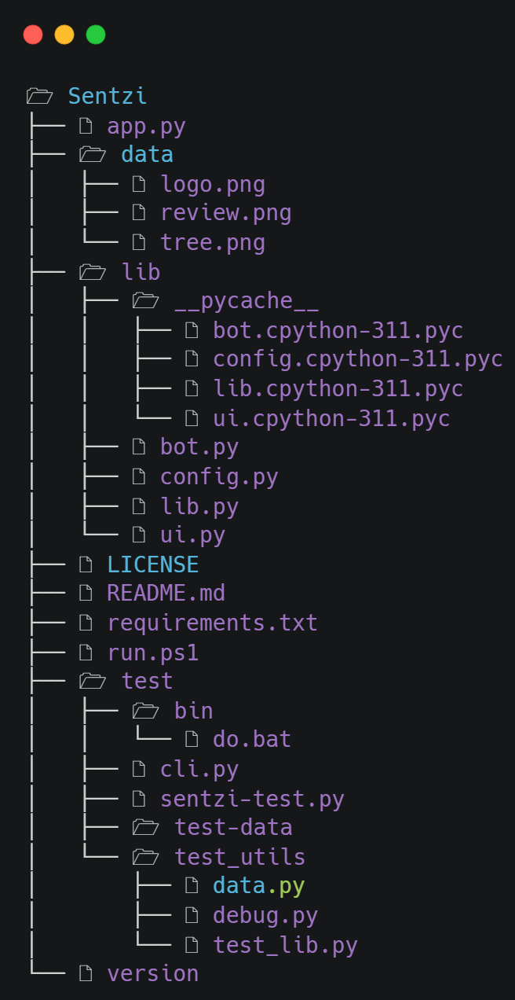

# Sentzi

## 🎉 Try now on [Space](https://huggingface.co/spaces/Sreezx/Sentzi) 

A fun 🥳 project made to demonstrate the practical application of sentiment analysis 

This is a demo app made using [`Streamlit`](streamlit.io) Library ( the best Python library for creating beautiful web apps )

The sentiment analysis is achieved using [`Textblob`](https://github.com/sloria/TextBlob)

## Installation 📦

> To run the application locally 
- **(Optional)** Create a `venv` and activate it using 
```cmd
$ py -m venv sentzi-venv
$ sentzi-venv\Scripts\Activate.ps1 (for windows powershell)
(or )
  sentzi-venv\Scripts\activate.bat (for windows cmd)
(or )
  source bin/activate (for unix or linux)
```
- Install the dependencies using 
```cmd
$ pip install -r requirements.txt
```
- Make sure the project structure is _**similar**_ to this 



- Head to `root` dir and create a `.env` with the following code 

```cmd
export DEV_EMAIL_ID=an_emailID_to_use_for_email_bot

export DEV_PASS=password_of_that_emailID
```

- Everything is ready ! Run the `streamlit` app using 
```cmd
$ streamlit run app.py
```
and enjoy 😎 !

