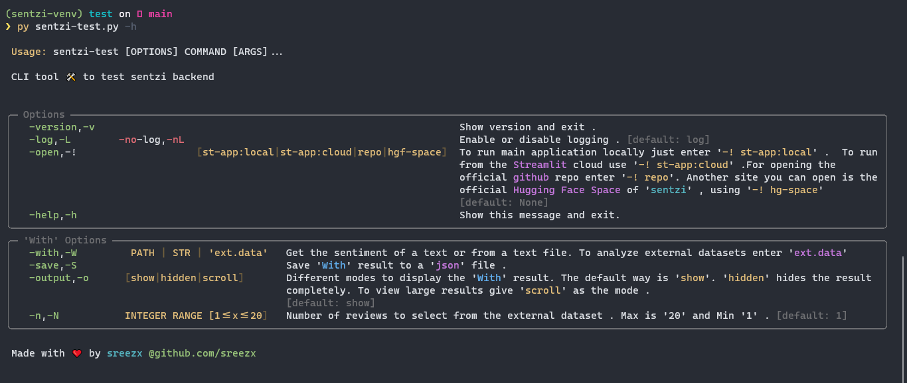

# Sentzi

## 🎉 Try now on `Streamlit` [`Cloud`](https://sentzi.streamlit.app/) (_`recommended`_) (or) [`Space`](https://huggingface.co/spaces/Sreezx/Sentzi) (_`very laggy !`_)

https://github.com/sreezx/Sentzi/assets/121812287/6cdc0681-56c2-44dd-bce6-e595056a8a6b

A fun 🥳 project made to demonstrate the practical application of sentiment analysis 

This is a demo app made using [`Streamlit`](streamlit.io) Library ( the best Python library for creating beautiful web apps )

The sentiment analysis is achieved using [`Textblob`](https://github.com/sloria/TextBlob)

## Installation 📦

> To run the application locally 
- **(Optional)** Create a `venv` (_sentzi-venv_) and activate it using 
```cmd
$ py -m venv sentzi-venv
$ sentzi-venv\Scripts\Activate.ps1 (for windows powershell)
(or )
  sentzi-venv\Scripts\activate.bat (for windows cmd)
(or )
  source bin/activate (for unix or linux)
```
- Install the dependencies using 
```cmd
$ pip install -r requirements.txt
```
- Make sure the project structure is _**similar**_ to this 


- Head to `root` dir and create a `.env` with the following code 

```cmd
DEV_EMAIL_ID=an_emailID_to_use_for_email_bot

DEV_PASS=password_of_that_emailID
```

- Everything is ready ! Run the `streamlit` app using 
```cmd
$ streamlit run app.py
```
and enjoy 😎 !

## Testing ⚙️ 

You can test the application locally using the `test\sentzi-test.py` CLI tool . 

> `sentzi-test.py` is an extension of the sentzi project made primarily to test the sentzi backend modules . 
---
_`sentzi-test help`_


---
_`Using '-with' option to get setiment of a text and saving it as 'json' file . '-o "show"' is default . `_

https://github.com/sreezx/Sentzi/assets/121812287/18f15e3a-340d-486e-aa83-2e07ebd9705c

---
_`Using '-with' option to get setiment from a text file . Here logging is disabled . `_

https://github.com/sreezx/Sentzi/assets/121812287/fd036d98-d65e-4a7d-91b4-028865bd5786

---
_`Using '-with' option to get setiment from an external dataset . Here output is hidden. `_

https://github.com/sreezx/Sentzi/assets/121812287/873b5792-bdb9-4008-9ad5-eb846ac8f210

---
_`Using '-with' option to get setiment from an external dataset . Here 12 reviews are retrieved from the dataset `_

https://github.com/sreezx/Sentzi/assets/121812287/85def485-b395-4adc-bb20-3d709b5494ba
